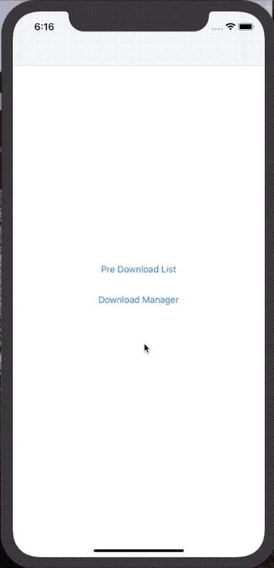
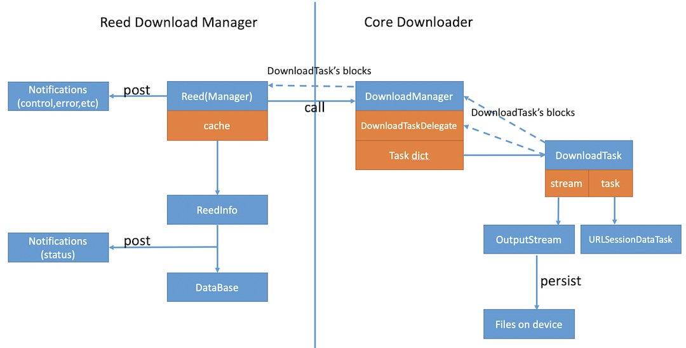

# Reed

[](http://cocoapods.org/pods/Reed)
<!--[](https://github.com/Carthage/Carthage)-->
[](http://cocoapods.org/pods/Reed)
[](http://cocoapods.org/pods/Reed)


Reed is a downloader framework for Swift. It is many fetures, stability，fast, ow coupling, easily extended. It use [ActiveSQLite](https://github.com/KevinZhouRafael/ActiveSQLite) to persist datas。

[**中文版**](README_cn.md)


## Features
- [x] Multi download tasks
- [x] Resume at break-point
- [x] Max concurrent count 
- [x] Validate md5 file
- [x] Check full space
- [x] Thread safe
- [x] Multi scope
- [x] Log with CocoaLumberjack
- [ ] Background download
- [ ] OperationQueue

## Demo


## Design




#### - Core Downloader -> Pure Downloader
Core Downloader only exist memory, it not use database. Can use it download without Reed layer.
#### - Reed Download Manager -> Download Manager
It save download model in database, deal with download status changes, handle errors, post notifications.

## Major Words


### 1 Model of download info

This is a simple version of model：

```
class ReedInfo {
    var key:String = "" //Identifier
    var url:String = ""
    var md5:String?
    var totalBytes:NSNumber = 0
    var writedBytes:NSNumber = 0
    var destFilePath = "" 
    var cacheFilePath = "" 
    
    var context = "" 
    var downloadListKey = ""  
    
    var downloadStatus:ReedDownloadStatus = .waiting 
    var downloadFailReason:ReedDownloadFailReason? 
    
}
```

### 2 Status of download

```
public enum ReedDownloadStatus: String {
    case waiting
    case downloading
    case pause
    case completed
    case faild
}
```

### 3 Reason of download failed

```
public enum ReedDownloadFailReason:String{
    case unknown
    case timeout
    case noNetwork
    case fullSpace
    case md5Verification
}
```

## Usage

### Start download

#### 1 Direct download

```Swift
/// key: Identifier
/// url: 
/// destinationFilePath：eg：”Documents/xxxx/filename.pdf“
/// downloadListKey : Default value is nil. can exist many than one downloadlist
/// md5: Value of md5. Default value is nil.
/// isReplace: Replace the old download destination file and cache file. Default value is false
Reed.shared.start(key:"key", url:"url", destinationFilePath:"Documents/filename.pdf",downloadListKey:"PDF_DOWNLOAD_LIST",md5:nil,isReplace:false)

```

#### 2 Add task to download list at first, and then start it.

```Swift

Reed.shared.addToStartList(key:"key", url:"url", destinationFilePath:"Documents/filename.xxx")


Reed.shared.start(key: "key")

```

#### 3 Add task to download list at first, and then check to start(Recommend)

```Swift

Reed.shared.addToStartList(key:"key", url:"url", destinationFilePath:"Documents/filename.xxx")

Reed.shared.checkToStart()

```

### Introduce checkToStart()<span id="checkToStart"></span>
#### Define：
checkToStart(downloadListKey:String? == nil)

#### Description：
check free space on device；<p>
check max concurrent download count in the downloadlist；<p>
start download task whoes is waiting status, and order by added date and ; <p>
<p>

#### Use Case：

1,Network become available. opposite shutdown. <p> 
2.User login. opposite shutdown. <p>
3.App launch if need.<p> 
4.Reed call by its self when a download task change its status (complete，pause，failed，delete）. The downloading count sub 1, may start other waiting task.<p>

### Scope

<table>
<tr>
	<td>First</td>
	<td>Second</td>
	<td>Third</td>
</tr>
<tr>
    <td rowspan="7"> context1 <br/>
    <td rowspan="3">DownloadListKey1</td>
    <td>key1</td>
</tr>
<tr>
    <td>key2</td>
</tr>
<tr>
   <td>key3</td>
</tr>
<tr>
	<td rowspan="4">DownloadListKey2</td>
 	<td>key4</td>
</tr>
<tr>
   <td>key5</td>
</tr>
<tr>
   <td>key6</td>
</tr>
<tr>
   <td>key7</td>
</tr>

</table>

#### 1 context
context is first level scope<p>
The value of ReedInfo.context come from the value of Reed.shared.context. they are the same. <p>
eg: App launch -> set Reed.shared.context -> start download.<p>
eg: shutDown() -> set Reed.shared.context -> start download.<p>
context usually used to separate different users.<p>
eg: logout() -> shutDown() -> login() -> set Reed.shared.context. <p>

#### 2 downloadlistkey
downloadListKey is a porperty of ReedInfo.<p>
A pair of context and downloadListKey define a downloadListKey, it has itself‘s max concurrent download count. <p>
downloadlistkey usually used for different business eg:named PDF_LIST, MP3_LIST.

#### 3 key
key is a porperty of ReedInfo, you must set every task different identifier key.<p>


### Notifications
Noti_ReedDownload_Add_To_Downlaod_List<p>
Noti_ReedDownload_Start<p>
Noti_ReedDownload_Progress <p>
Noti_ReedDownload_Complete<p>
Noti_ReedDownload_Fails<p>
Noti_ReedDownload_Waiting <p>
Noti_ReedDownload_Pause <p>
Noti_ReedDownload_Delete <p>
Noti_ReedDownload_FullSpace<p>
Every notification contains a object, its type is ReedInfo.<p>
If full space, Reed will post one or more notifications whose object is ReedInfo, and post 1 notification that object = nil.

### Most commonly used API

#### APIs relate control

```swift

	///Add a task to downloadlist
	public func addToStartList(key:String, url:String, destinationFilePath:String,downloadListKey:String? = nil,md5:String? = nil,isReplace:Bool = false)

    /// start download when added a task to downloadlist
    public func start(_ key:String, isReplace:Bool = false)
    
    /// Direct download. not recommend. Recommend use addToStartList and checkToStart.
    public func start(key:String, url:String, destinationFilePath:String, downloadListKey:String? = nil,md5:String? = nil,isReplace:Bool = false)
    
    /// batch start download
    public func startBatch(keys:[String])
    
    /// check to start. Go to "Introduce checkToStart()" on this ReadMe.
    public func checkToStart()
    
    /// check to start on this downloadList.
    public func checkToStart(downloadListKey:String)
    
    ///isTryStart meens：If call checkToStart() after the action. usually use default value.
        
    public func pause(_ key:String, isTryStart:Bool? = true)

    public func pauseBatch(keys:[String],isTryStart:Bool? = true)

    public func deleteBatch(keys:[String],isTryStart:Bool? = true)
    
    public func delete(_ key:String,isTryStart:Bool? = true)
    
    //Shutdown all tasks. But all status of tasks are not changed. 
    //Execute this when：logout；no network；go to background.
    public func shutDown()
    
```

#### APIs relate status

```swift

    /// is downloading progress
    /// (Downloading, waiting, pause, failed)
    public func isDownloadingProgress(_ key:String) -> Bool
    
    /// is undownload (un add to download list, un start, no record on database)
    public func isUnDownload(_ key:String) -> Bool
    
    public func isComplete(_ key:String) -> Bool
    
    public func isDownloading(_ key:String) -> Bool
    
    public func isPause(_ key:String) -> Bool
    
    public func isWaiting(_ key:String) -> Bool
    
    public func isFailed(_ key:String) -> Bool
    
    /// get download model with key
    public func getDownloadInfo(key:String) -> ReedInfo?
    
    /// get all models on this downloadListKey
    public func getDownloadInfos(downloadListKey:String? = nil) -> [ReedInfo]
    
    /// get all models on download progress（Downloading，Waiting，Pause，Failed）
    public func getDownloadProgressInfos(downloadListKey:String? = nil) -> [ReedInfo]
    
    /// get all complete models
    public func getCompleteInfos(downloadListKey:String? = nil) -> [ReedInfo]
    
    @objc public func getDownloadProgressCount(downloadListKey:String? = nil) -> Int
    
    @objc public func getDownloadingCount(downloadListKey:String? = nil) -> Int

    @objc public func getWaitingCount(downloadListKey:String? = nil) -> Int
    
    @objc public func getPauseCount(downloadListKey:String? = nil) -> Int
    
```

### Config

```swift

 	 /// Concurrent max download count on one downloadlist，default value is 3
    Reed.shared.maxCount
    
    /// Retry count when md5 invalidate，default value is 3
    Reed.shared.maxRetryCount 

    /// Set it before start download, default value is ""
    public var context
    
    /// min interval between two download progress notifications been post, default value is 0.3 seconds
    Reed.shared.progressPostTimeInterval:TimeInterval
    
    /// If you use CocoaLumberjack，Reed would use your CocoaLumberjack configration.
    /// If you not use CocoaLumberjack, Reed would not print whenever what value of showLogger.
    Reed.shared.showLogger:Bool = true
    
    /// If you not use CocoaLumberjack，Call this method to config CocoaLumberjack
    /// timeFormatter：Date message of every log，default value is "yyyy-MM-dd'T'HH:mm:ss.SSSZ" of Date()
    public func configLogger(level:DDLogLevel? = .info, timeFormatter:(()->String)? = nil)

```

## Requirements
- iOS 8.0+  
- Xcode 10.2
- Swift 5

## Installatio

### Cocoapods

Aadd the following line to your Podfile:

```ruby
pod "Reed"
```

## Author

Kevin Zhou

- **Email**: <wumingapie@gmail.com>
- **Facebook**: [**wumingapie**](https://www.facebook.com/wumingapie)
- **微信&QQ**: 458545592

## License

Reed is available under the MIT license. See the LICENSE file for more info.
