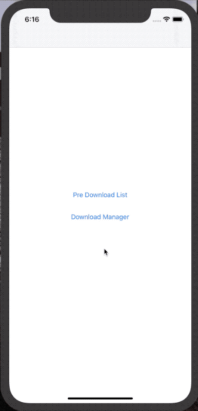

# Reed

[](http://cocoapods.org/pods/Reed)
<!--[](https://github.com/Carthage/Carthage)-->
[](http://cocoapods.org/pods/Reed)
[](http://cocoapods.org/pods/Reed)


Reed 是一个Swift下载框架。功能强大，高效而稳定，低耦合。下载管理层使用了[ActiveSQLite](https://github.com/KevinZhouRafael/ActiveSQLite)。

[**English Version**](README.md)


## 特性
- [x] 多任务下载
- [x] 断点续传
- [x] 最大并发数
- [x] md5文件校验
- [x] 磁盘空间判断
- [x] 线程安全
- [x] 多个作用域
- [x] CocoaLumberjack
- [ ] 后台下载
- [ ] OperationQueue

## Demo


## 设计


#### - Core Downloader 下载器。
只存在于内存中，没有数据库。可以不使用Reed层，直接使用DownloadManager下载
#### - Reed Download Manager 下载管理器。
储存下载模型到数据库中，处理下载状态的改变，处理错误，分发通知。

## 词汇描述


### 1 下载数据模型

以下是下载数据模型的简化版：

```
class ReedInfo {
    var key:String = "" //下载唯一标示
    var url:String = ""
    var md5:String?
    var totalBytes:NSNumber = 0
    var writedBytes:NSNumber = 0
    var destFilePath = ""  //下载目标路径
    var cacheFilePath = ""  //下载缓存路径
    
    var context = "" //上下文。
    var downloadListKey = ""  //下载列表
    
    var downloadStatus:ReedDownloadStatus = .waiting  //下载状态
    var downloadFailReason:ReedDownloadFailReason?  //下载错误原因
    
}
```

### 2 下载状态

```
public enum ReedDownloadStatus: String {
    case waiting
    case downloading
    case pause
    case completed
    case faild
}
```

### 3 下载失败原因

```
public enum ReedDownloadFailReason:String{
    case unknown
    case timeout
    case noNetwork
    case fullSpace
    case md5Verification
}
```

## 用法

### 发起下载

#### 1 直接下载

```Swift
/// key: 下载唯一标示
/// url: 下载url
/// destinationFilePath：下载到的目标文件。eg：”Documents/xxxx/filename.pdf“
/// downloadListKey : 下载列表。默认为nil。用来区别不同的下载列表，不同列表下载任务之间没有关系。
/// md5: 是否需要md5校验文件: 默认为nil
/// isReplace:是否需要替换掉下载过的文件和缓存：默认为false，不替换，即不删除老文件。
Reed.shared.start(key:"key", url:"url", destinationFilePath:"Documents/filename.pdf",downloadListKey:"PDF_DOWNLOAD_LIST",md5:nil,isReplace:false)

```

#### 2 先添加下载列表，再开始下载

```Swift

Reed.shared.addToStartList(key:"key", url:"url", destinationFilePath:"Documents/filename.xxx")


Reed.shared.start(key: "key")

```

#### 3 先添加下载列表，再检查可下载的任务(建议)

```Swift

Reed.shared.addToStartList(key:"key", url:"url", destinationFilePath:"Documents/filename.xxx")

Reed.shared.checkToStart()

```

### checkToStart方法说明
#### 定义：
checkToStart(downloadListKey:String? == nil)

#### 描述：
自动检测剩余空间是否满；<p>
下载列表中可并行下载最大数量是否超标；<p>
按照添加时间顺序，开始下载等待中的任务。<p>
<p>

#### 使用场景：

1,无网到有网。对应 shutdown. <p> 
2.用户登录。 对应 shutdown. <p>
3.app启动。<p> 
4.Reed下载框架自动调用。当一个下载任务状态变为(完成，暂停，失败，删除）的时候<p>

### 作用域

<table>
<tr>
	<td>First</td>
	<td>Second</td>
	<td>Third</td>
</tr>
<tr>
    <td rowspan="7"> context1 <br/>
    <td rowspan="3">DownloadListKey1</td>
    <td>key1</td>
</tr>
<tr>
    <td>key2</td>
</tr>
<tr>
   <td>key3</td>
</tr>
<tr>
	<td rowspan="4">DownloadListKey2</td>
 	<td>key4</td>
</tr>
<tr>
   <td>key5</td>
</tr>
<tr>
   <td>key6</td>
</tr>
<tr>
   <td>key7</td>
</tr>

</table>
#### 1 context
context是一级作用域，context不同的话，即使downloadlistkey和key相同，也算作不同作用域。<p>
context存在于 Reed.shared.context和ReedInfo.context中，其数值是相同的。<p>
例如: App启动 -> 设置Reed.shared.context -> 开始下载。<p>
例如: shutDown() -> 设置Reed.shared.context -> 开始下载。<p>
context常常用于区分用户。<p>
例如: logout() -> shutDown() -> login() -> 设置Reed.shared.context. <p>

#### 2 downloadlistkey
downloadListKey相同，而context不同，被认为不同的作用域.<p>
downloadListKey是ReedInfo的属性。用于区分不同下载列表。<p>
同一个下载列表共享同一个 maxCount 可并发下载最大数量。 不同列表的maxCount相同，默认是3。<p>
downloadlistkey通常用于业务相关，如命名为，PDF_LIST, MP3_LIST.

#### 3 key
key是ReedInfo的属性，是每个下载任务的唯一id。<p>
只有context不同，downloadlistkey不同，才算作不同。

### 下载通知
Noti_ReedDownload_Add_To_Downlaod_List 添加到下载列表<p>
Noti_ReedDownload_Start 开始下载<p>
Noti_ReedDownload_Progress 下载进度<p>
Noti_ReedDownload_Complete 下载完成<p>
Noti_ReedDownload_Fails 下载失败<p>
Noti_ReedDownload_Waiting 下载变为等待状态<p>
Noti_ReedDownload_Pause 下载变为暂停状态<p>
Noti_ReedDownload_Delete 删除下载任务<p>
Noti_ReedDownload_FullSpace 磁盘空间即将满<p>
每个通知都携带一个object对象，类型为ReedInfo。<p>
如果磁盘空间满，那么会发送>=1个object = ReedInfo的通知，和1个object = nil的通知。

### 常用API

#### 控制相关API
```swift

	///添加到下载列表
	public func addToStartList(key:String, url:String, destinationFilePath:String,downloadListKey:String? = nil,md5:String? = nil,isReplace:Bool = false)

    /// 已添加到下载列表，开始下载
    public func start(_ key:String, isReplace:Bool = false)
    
    /// 直接开始下载。不建议使用。建议使用 addToStartList 和 checkToStart的组合
    public func start(key:String, url:String, destinationFilePath:String, downloadListKey:String? = nil,md5:String? = nil,isReplace:Bool = false)
    
    /// 批量开始下载
    public func startBatch(keys:[String])
    
    /// 自动检测剩余空间是否满，下载列表中最大数量是否超标，按照添加时间顺序，开始下载等待中的任务。
    /// 1,无网到有网。对应 shutdown.  1.noNetwork -> network
    /// 2.用户登录。 对应 shutdown.   2.user login
    /// 3，app启动。                 3.start up app
    /// 4,框架内部调用                4. Invoke in Reed framework( when one item's status changes)
    public func checkToStart()
    
    /// 检测并启动下载，只检测downloadListKey中任务。
    public func checkToStart(downloadListKey:String)
    
    ///以下方法的isTryStart参数含义： 表示当操作之后，是否调用checkToStart。一般使用默认即可。
        
    ///暂停
    public func pause(_ key:String, isTryStart:Bool? = true)

    /// 批量暂停
    public func pauseBatch(keys:[String],isTryStart:Bool? = true)

    /// 删除多个
    public func deleteBatch(keys:[String],isTryStart:Bool? = true)
    
    /// 删除一个
    public func delete(_ key:String,isTryStart:Bool? = true)
    
    //终止所有下载任务。任务的状态不变。
    //执行时机：用户退出；断网；进入后台。
    public func shutDown()
    
```

#### 状态相关API

```swift

    /// 是否下载中（下载中，等待，暂停，失败）
    /// (Downloading, waiting, pause, failed)
    public func isDownloadingProgress(_ key:String) -> Bool
    
    /// 是否未下载状态(未添加过下载列表，即数据库无该下载任务)
    public func isUnDownload(_ key:String) -> Bool
    
    /// 是否已下载
    public func isComplete(_ key:String) -> Bool
    
    /// 是否下载中
    public func isDownloading(_ key:String) -> Bool
    
    /// 是否暂停状态
    public func isPause(_ key:String) -> Bool
    
    /// 是否等待状态
    public func isWaiting(_ key:String) -> Bool
    
    /// 是否下载失败
    public func isFailed(_ key:String) -> Bool
    
    /// 通过key获得下载model
    public func getDownloadInfo(key:String) -> ReedInfo?
    
    /// 获取downloadListKey下，所有models
    public func getDownloadInfos(downloadListKey:String? = nil) -> [ReedInfo]
    
    /// 获取所有下载中的models（下载中Downloading，等待Waiting，暂停Pause，失败Failed）
    public func getDownloadProgressInfos(downloadListKey:String? = nil) -> [ReedInfo]
    
    /// 获取所有下载完成的models
    public func getCompleteInfos(downloadListKey:String? = nil) -> [ReedInfo]
    
    /// 获取所有下载过程中的数量（下载中Downloading，等待Waiting，暂停Pause，失败Failed）
    @objc public func getDownloadProgressCount(downloadListKey:String? = nil) -> Int
    
    /// 获取下载中的数量
    @objc public func getDownloadingCount(downloadListKey:String? = nil) -> Int

	 /// 获取等待中的数量   
    @objc public func getWaitingCount(downloadListKey:String? = nil) -> Int
    
    /// 获取暂停中的数量
    @objc public func getPauseCount(downloadListKey:String? = nil) -> Int
    
```

### 配置

```swift

 	 /// 单个下载列表的最大并发下载数，默认为 3
    Reed.shared.maxCount
    
    /// md5校验错误后的重试次数，默认为3
    Reed.shared.maxRetryCount 

    ///上下文。保证下载未启动前设置，或者设置前调用shutdown()。默认值为""
    public var context
    
    /// 下载进度刷新 的间隔最短时间, 默认为0.3秒
    Reed.shared.progressPostTimeInterval:TimeInterval
    
    /// 如果你使用了CocoaLumberjack，那么Reed会使用你设置的CocoaLumberjack配置作为日志输出。
    /// 如果你没有配置CocoaLumberjack,那么不论showLogger值为何，都不会有日志输出。
    Reed.shared.showLogger:Bool = true
    
    /// 如果你没有使用CocoaLumberjack，调用此方法即可配置CocoaLumberjack
    /// timeFormatter：每条日志的时间信息，默认是Date()的"yyyy-MM-dd'T'HH:mm:ss.SSSZ"格式
    public func configLogger(level:DDLogLevel? = .info, timeFormatter:(()->String)? = nil)

```

## 硬件需求
- iOS 8.0+  
- Xcode 10.2
- Swift 5

## 安装

### Cocoapods

再Podfile文件中添加:

```ruby
pod "Reed"
```

## 作者

Kevin Zhou

- 邮件: <wumingapie@gmail.com>
- **Facebook**: [**wumingapie**](https://www.facebook.com/wumingapie)
- **微信&QQ**: 458545592

## License

Reed is available under the MIT license. See the LICENSE file for more info.
